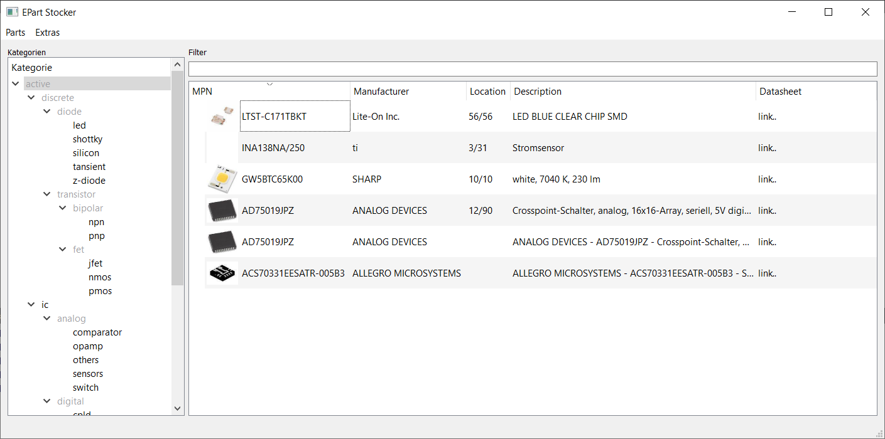
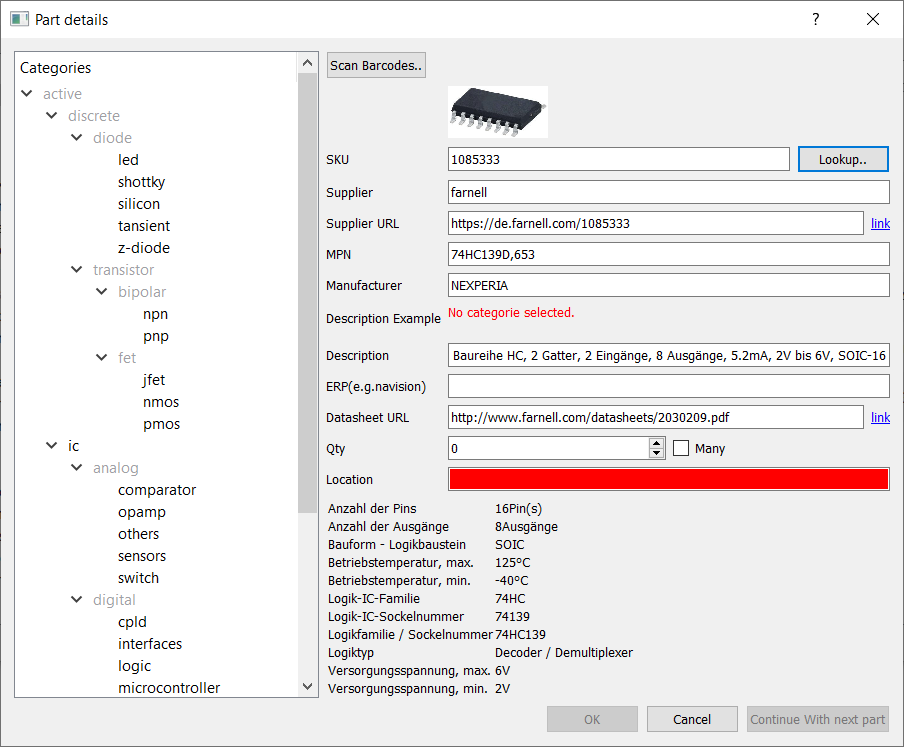
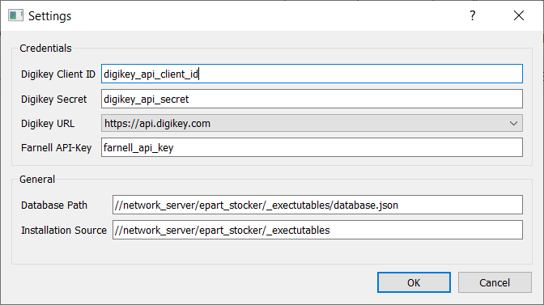
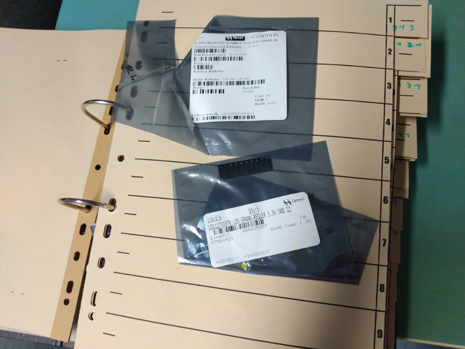

# EPart Stocker
This is yet another tool for registering your electronic components in your lab.
Each part will get a location ID which will make it very easy to find it again.
This is not the first tool which does this. However one point is very special, 
which made it necessary to program our own one. In this case the file system is used as 
storage which facilitates the use because you don’t need a server with PHP etc. Even in a 
small company it might be difficult to convince your IT-Department to install a Webserver/MYSQL 
and include it in the backup system. Here we only rely on a shared file system.

## Screenshots

## Features
- Find your part by selecting its category and use the filter to search for MPN, description and location.
- Very simple to create a new part. Just enter a Farnell or Digikey sku and click the "lookup" button. Part imgage and parameters, Datasheet-link, and description will be downloaded automatically.
- Enforce a description scheme by defining regex validators per category. Especially if more than one person work with the tool this might be helpful to keep everything tidy.
- Ensure everybody uses the same and latest version by putting the executables in a shared folder of your network and define its path. The tool checks each time on start up if there is a later version.
- Easy to understand JSON format as storage.

## How to use

Just copy the executable on your disk and start the tool. However the part parameter download feature only works if you request a Farnell API 
key (https://de.farnell.com/epass-api) and a Digikey API access.( https://developer.digikey.com/get_started / Product Information API)

